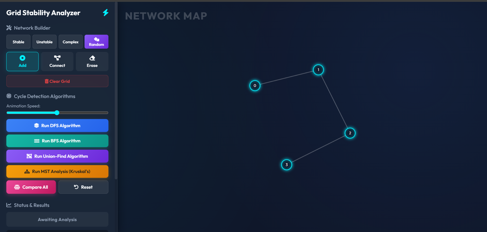
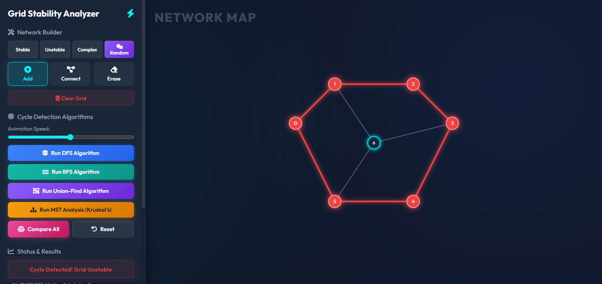
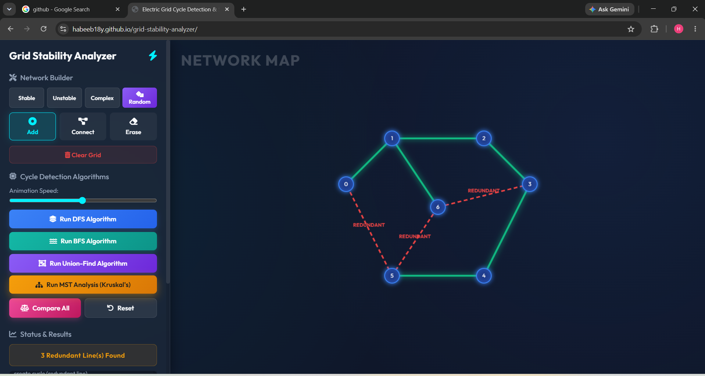

# ⚡ Grid Stability Analyzer

## Overview

Grid Stability Analyzer is an interactive web-based application developed to analyze electric power grid networks using graph algorithms. The system enables users to create custom network topologies, detect cycles, evaluate grid stability, and generate Minimum Spanning Trees for optimized network design.

## Problem Statement

Electric power grids consist of interconnected substations and transmission lines. Unintended cycles can introduce redundancy, fault propagation, and operational inefficiencies. This project helps identify such cycles and analyze network stability using graph-theoretic techniques.

## Features

* Interactive graph creation and visualization
* Add and connect substations dynamically
* Cycle detection using:

  * Depth First Search (DFS)
  * Breadth First Search (BFS)
  * Union-Find (Disjoint Set)
* Minimum Spanning Tree generation using Kruskal's Algorithm
* Real-time network analysis
* User-friendly graphical interface

## Algorithms Implemented

| Algorithm     | Purpose                   | Time Complexity |
| ------------- | ------------------------- | --------------- |
| DFS           | Cycle Detection           | O(V + E)        |
| BFS           | Graph Traversal           | O(V + E)        |
| Union-Find    | Efficient Cycle Detection | O(E α(V))       |
| Kruskal's MST | Minimum Spanning Tree     | O(E log E)      |

## Technologies Used

* HTML5
* CSS3
* JavaScript
* Graph Theory
* Data Structures & Algorithms

## Project Structure

```text
grid-stability-analyzer/
├── index.html
├── style.css
├── script.js
└── README.md
```

## Learning Outcomes

* Graph Representation
* Cycle Detection Techniques
* Minimum Spanning Tree Construction
* Network Stability Analysis
* Algorithm Visualization

## Future Enhancements

* Weighted graph support
* Dijkstra's Shortest Path Algorithm
* Prim's MST Algorithm
* Export analysis reports
* Dark mode interface

## Screenshots

### Main Interface



### Cycle Detection



### MST Analysis



## Author

Habeebulla Y

MCA – RV College of Engineering, Bengaluru

GitHub: https://github.com/habeeb18y
